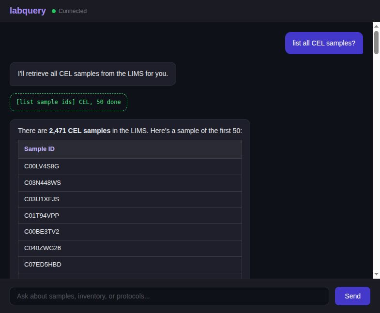

# labquery

Natural language interface for LIMS and liquid handler automation. Ask questions about your samples, run protocols, and measure plates through a chat interface backed by Claude tool use and PyLabRobot.



## Setup

```bash
python3 -m venv labquery-env
source labquery-env/bin/activate
pip install -e ".[dev]"
cp .env.example .env   # then fill in your Anthropic API key
```

## Usage

LIMS starts automatically (defaults to local SQLite). `--simulator` selects the simulated liquid handler. Required until hardware drivers are validated.

```bash
# Chat UI with local LIMS + simulated liquid handler (default, no external deps)
labquery --simulator --serve

# --seed populates the local LIMS with 10,000 random samples for testing
labquery --simulator --seed --serve
```

Select a LIMS backend:

```bash
labquery --lims local --simulator --serve        # local SQLite (default)
labquery --lims labio --simulator --serve         # labio-all (auto-cloned into /tmp/labio-all)
labquery --lims benchling --simulator --serve     # Benchling (requires env vars, see below)
labquery --lims elabjournal --simulator --serve   # eLabJournal (requires env vars, see below)
```

Select a liquid handler backend:

```bash
labquery --simulator --backend opentrons --serve  # OT-2 deck (default)
labquery --simulator --backend tecan --serve      # EVO 150 deck
labquery --simulator --backend hamilton --serve    # STARLet deck
```

Add `--visualizer` to open the PLR deck viewer (Opentrons only for now):

```bash
labquery --simulator --serve --visualizer
```

Single query from the command line:

```bash
labquery --simulator "how many CEL samples are available?"
```

Interactive REPL:

```bash
labquery --simulator
```

Connect to Benchling:

```bash
export BENCHLING_URL=https://mycompany.benchling.com
export BENCHLING_API_KEY=sk_...
pip install labquery[benchling]
labquery --lims benchling --simulator --serve
```

Connect to eLabJournal:

```bash
export ELABJOURNAL_URL=https://mycompany.elabjournal.com
export ELABJOURNAL_API_KEY=your_key
labquery --lims elabjournal --simulator --serve
```

Connect to an existing labio-all instance:

```bash
labquery --lims labio --lims-url http://your-lims:5001 --simulator --serve
```

Enable Slack notifications for run completions and errors:

```bash
labquery --simulator --serve --slack-webhook https://hooks.slack.com/services/T.../B.../...
# or via env var:
export SLACK_WEBHOOK_URL=https://hooks.slack.com/services/T.../B.../...
labquery --simulator --serve
```

## What it does

- **Sample queries** -- look up location, volume, concentration, material type
- **Inventory checks** -- count available samples by type, check if you have enough for a run
- **Protocol execution** -- run liquid handling protocols (CEL/DNA combination, serial dilution, sample transfer) with automatic LIMS volume writeback
- **Ad-hoc liquid handling** -- transfer liquid between arbitrary wells with user-specified volumes, no pre-defined protocol needed
- **Aspirate/dispense** -- fine-grained control for complex patterns like one-to-many or multi-step sequences
- **Deck introspection** -- check well contents, tip counts, and rack state on the liquid handler
- **Plate reader measurements** -- measure midi-chlorian signal with BAC/PRO safety guards
- **Slack notifications** -- post run completions, errors, and measurements to a Slack channel

## Supported backends

| Backend | Deck | Simulator | Hardware |
| --- | --- | --- | --- |
| `opentrons` (default) | OT-2 | OT-2 Simulator | stubbed |
| `tecan` | EVO 150 | ChatterBox | stubbed |
| `hamilton` | STARLet | ChatterBox | stubbed |

`--backend` selects the liquid handler platform (deck layout, labware, driver). `--simulator` controls whether the simulator or hardware driver is used. Hardware is the default but currently stubbed for all backends. **Use `--simulator` until hardware drivers are validated.** Running without it will exit with an error.

To connect to real hardware, you would need to:

1. Remove the hardware gate in `plr_bridge.py` (the `NotImplementedError` in `PLRBridge.setup()`)
2. Customize the deck layout function for your machine (`_setup_tecan_deck`, `_setup_hamilton_deck`, or `_setup_opentrons_deck`) -- the slot assignments, carrier types, and labware definitions are placeholders and will likely not match your physical deck
3. Install any required drivers or connection software for your platform (e.g., EVOware for Tecan, VENUS for Hamilton)
4. Note that Tecan and Hamilton deck layouts have no tube rack (`tube_rack=None`), so named protocols that place tube samples will not work -- use the `transfer` and `aspirate_dispense` tools with plate wells instead

## Architecture

```text
labquery/
  cli.py           -- entry point, CLI flags, mode selection
  nl_layer.py      -- Claude tool-use loop and ToolDispatcher
  tools.py         -- tool definitions and system prompt
  lims_client.py   -- abstract LIMSClient + labio-all REST implementation
  lims_server.py   -- local SQLite-backed LIMS (Flask API, same shape as labio-all)
  plr_runner.py    -- protocol registry, simulated and bridge execution
  plr_bridge.py    -- BackendConfig presets, PLR bridge for all backends
  well_utils.py    -- well range parsing and validation (A1-A6 expansion)
  notify.py        -- Slack webhook notifications (stub when unconfigured)
  measure.py       -- plate reader binary interface
  labio_server.py  -- auto-clone and start labio-all as a subprocess
  ws_server.py     -- WebSocket chat server with streaming responses
  static/          -- browser chat UI
notebooks/
  demo.ipynb       -- end-to-end walkthrough notebook
```

## Testing

```bash
pytest
```

Unit and integration tests run without any external services. The toy problem benchmark (`test_toy_problem.py`) requires labio-all running on localhost:5001 and skips automatically if it's not available.

## Issues

Found a bug or have a feature request? [Open an issue](https://github.com/joemoore94/labquery/issues).

## License

MIT
